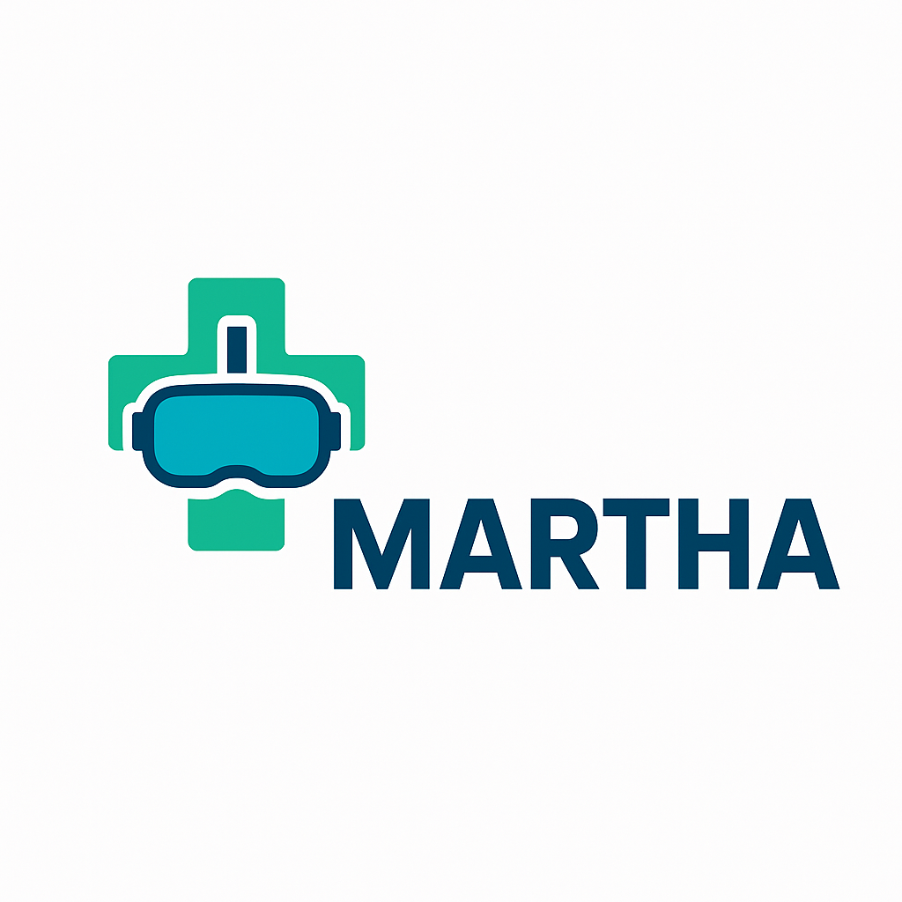
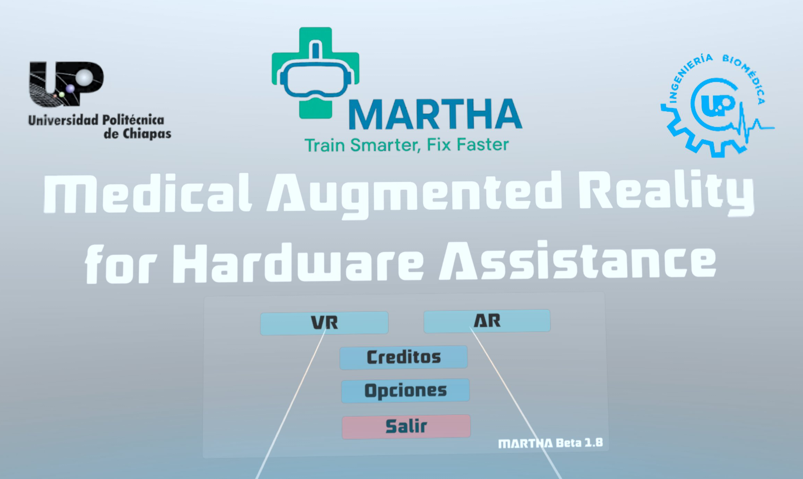
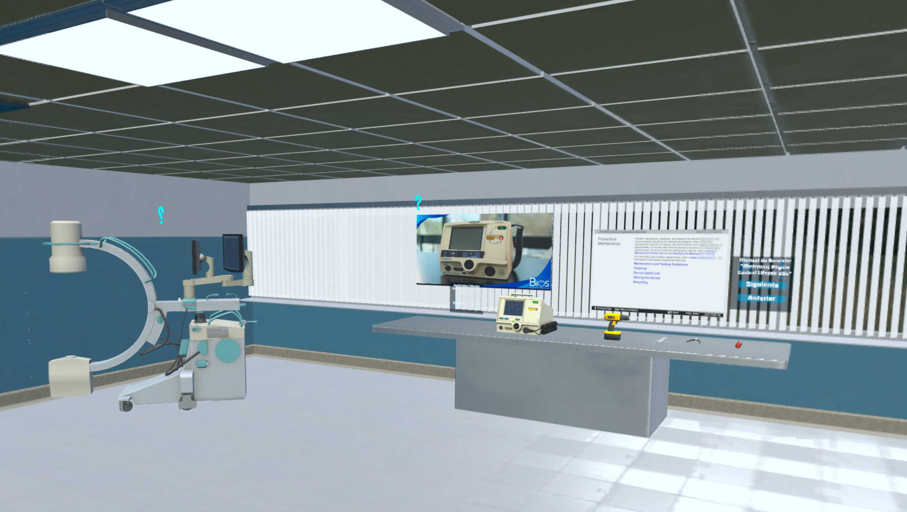
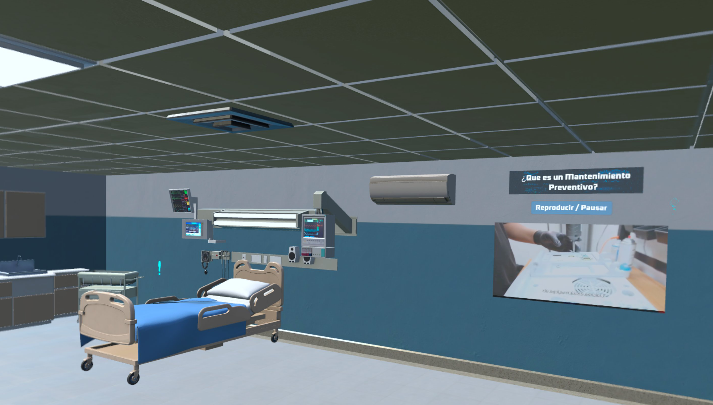
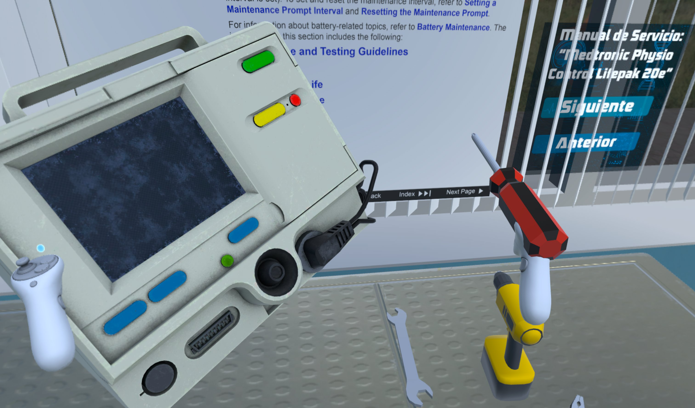
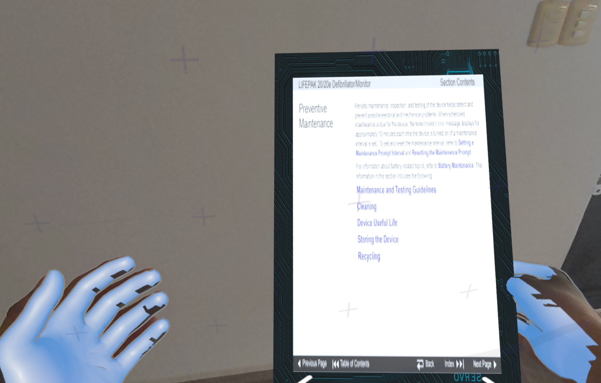

# 🥽 Project MARTHA: Capacitación en Mantenimiento con Realidad Mixta
<p align="center">
  
</p>
Este repositorio contiene el código fuente y los activos del **Proyecto MARTHA**, una plataforma de capacitación en mantenimiento preventivo de equipos médicos desarrollada con **Realidad Mixta (MR)** para visores **Meta Quest**.

Este proyecto fue desarrollado en la Universidad Politécnica de Chiapas.

## 📜 Resumen del Proyecto

La plataforma integra una interfaz de usuario dentro de un entorno virtual inmersivo. Permite a los ingenieros biomédicos acceder a manuales técnicos, diagramas interactivos y guías multimedia superpuestas sobre el equipo (virtual o real).

El objetivo es superar la dependencia de manuales físicos y ofrecer una capacitación práctica, interactiva y segura, mejorando la retención del conocimiento y la eficiencia en el mantenimiento.

## ✨ Características Principales

* **Entorno de Realidad Mixta:** Superpone información digital (guías, videos) sobre el entorno real (requiere Meta Quest 3/Pro) o en un entorno completamente virtual.
* **Interfaz Interactiva:** Menús y paneles de control para acceder a manuales, diagramas y tutoriales.
* **Guías Visuales:** Pasos de mantenimiento presentados de forma visual e interactiva.
* **Desarrollado en Unity:** Utiliza el SDK de Meta (Oculus Integration) para la funcionalidad de MR.

## 🛠️ Stack Tecnológico

* **Motor de Videojuego:** Unity 3D (Se recomienda versión `2022.3.x LTS` o la que hayas usado)
* **Plataforma:** Meta Quest 2 / Quest 3 / Quest Pro
* **Lenguaje:** C#
* **SDK Principal:** Meta XR SDK (Oculus Integration)

---

## ⚙️ Instalación y Uso

Para ejecutar este proyecto, necesitas tener instalado Unity Hub y la versión de Unity correcta.

1.  **Clona el repositorio:**
    ```bash
    git clone [https://github.com/TU-USUARIO/project-martha-mr.git](https://github.com/TU-USUARIO/project-martha-mr.git)
    cd project-martha-mr
    ```

2.  **Abre el Proyecto en Unity Hub:**
    * Abre Unity Hub.
    * Haz clic en "Open" -> "Add project from disk".
    * Selecciona la carpeta `project-martha-mr` que acabas de clonar.
    * Unity descargará automáticamente los paquetes (`Packages/`) y generará la carpeta `Library` (esto puede tardar varios minutos).

3.  **Configura el Build:**
    * Ve a `File > Build Settings...`.
    * Asegúrate de que la plataforma seleccionada sea **Android**.
    * Configura los `Player Settings` para XR (asegúrate de que el Plug-in Provider de Meta esté activo).

4.  **Ejecuta el Proyecto:**
    * **Opción A (Link/AirLink):** Conecta tu Meta Quest a tu PC y presiona "Play" en el editor de Unity.
    * **Opción B (Build):** Ve a `File > Build and Run` para compilar el `.apk` e instalarlo directamente en tu visor.

---

## 📸 Demostración / Capturas

<p align="center">
  
  <br><em>Menú principal de MARTHA (VR y AR)</em>
</p>
<p align="center">
  
  <br><em>Entorno virtual de la sala de mantenimiento (VR)</em>
</p>
<p align="center">
  
  <br><em>Guía multimedia en la sala de pacientes (VR)</em>
</p>
<p align="center">
  
  <br><em>Inspección detallada de equipo y herramientas (VR)</em>
</p>
<p align="center">
  
  <br><em>Visualización de manual técnico (Modo AR)</em>
</p>
